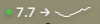
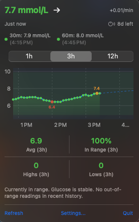

# LibreBar

Open-source macOS menu bar app for real-time glucose monitoring via LibreLinkUp or Nightscout.

`LibreBar` is a lightweight menu bar utility that connects to your LibreLinkUp account or Nightscout instance and displays your latest glucose reading, trend arrow, and history graph directly in the macOS menu bar. It is designed to be simple, fast, and always visible — no need to reach for your phone to check your glucose.

### Menu Bar

### Popover

### Settings
![Settings]

## What It Does

LibreBar gives you a persistent glucose reading in your menu bar with a popover for detailed information.

Core workflow:

1. Launch LibreBar.
2. Choose your data source (LibreLinkUp or Nightscout) in Settings.
3. Enter your credentials or Nightscout URL.
4. Your current glucose reading and trend arrow appear in the menu bar.
5. Click the menu bar item to see detailed info: color-coded reading, mini graph, rate of change, predictions, and stats.
6. LibreBar refreshes automatically every 60 seconds.

Everything is built around the idea that checking your glucose should be instant and effortless — a glance at the menu bar, nothing more.

## Features

- **Menu bar display** — live glucose reading, trend arrow, color indicator dot, and mini sparkline graph
- **Dual data source** — connect via LibreLinkUp or Nightscout
- **Color-coded readings** — green for in-range, orange for high/low, red for urgent
- **Interactive graph** — selectable time range (1h, 3h, 12h, 24h with Nightscout) with gradient fill, prediction line, and min/max markers
- **Glucose predictions** — 30-minute and 60-minute forecasts with color-coded status dots
- **Configurable graph** — toggle min/max markers and prediction line on/off in Settings
- **Auto-update checker** — checks GitHub for new releases on launch, with manual check in Settings
- **Stats dashboard** — average glucose, % in range, highs count, lows count
- **AI analysis** — plain-English summary of current status, trend, and last out-of-range reading
- **Rate of change** — mmol/L or mg/dL per minute
- **Sensor days remaining** — countdown for LibreLinkUp users
- **Time since last reading** — with stale data warning (15+ minutes)
- **Global keyboard shortcut** — user-configurable hotkey to toggle the popover from anywhere
- **Unit toggle** — switch between mmol/L and mg/dL
- **Customizable thresholds** — target range sliders for low and high
- **Multiple connections** — choose which person to monitor (LibreLinkUp)
- **Automatic region detection** — for the LibreLinkUp API
- **Launch at login** — start automatically with macOS
- **Secure storage** — credentials stored in the macOS Keychain
- **Menu bar utility** — no dock icon, no clutter

## Privacy

LibreBar communicates only with the official LibreLinkUp API (libreview.io) or your own Nightscout instance.

- Credentials are stored locally in the macOS Keychain
- No analytics, no telemetry, no third-party services
- No data is stored or transmitted beyond what is required to fetch your glucose readings

## Tech Stack

- Swift
- SwiftUI
- AppKit
- Swift Charts
- CryptoKit
- Carbon (global hotkeys)
- ServiceManagement
- macOS Keychain Services

## Installation

### Requirements

- macOS 14.0 or later
- A LibreLinkUp account with at least one active connection, **or** a Nightscout instance URL

### Download

1. Download **LibreBar.dmg** from the [latest release](https://github.com/mounirelchoueiri/LibreBarMacOS/releases/latest)
2. Open the DMG
3. Drag **LibreBar** to **Applications**
4. Launch LibreBar from Applications
5. Click `--` in the menu bar, then click **Settings**
6. Choose your data source (LibreLinkUp or Nightscout)
7. Enter your credentials or Nightscout URL and optional token
8. Click **Save & Connect**

> **⚠️ Important: macOS may block the app on first launch** because it is not notarized with Apple. If you see *"LibreBar Not Opened"* or *"cannot be opened because the developer cannot be verified"*:
>
> **Option 1 (recommended):** Right-click (or Control-click) LibreBar in Applications and select **Open**. Click **Open** in the dialog that appears. You only need to do this once.
>
> **Option 2:** Go to **System Settings > Privacy & Security**, scroll down to the security section, and click **Open Anyway** next to the LibreBar message.

### Building from Source

If you prefer to build the app yourself:

1. Clone the repository
2. Open `LibreBar/LibreBar.xcodeproj` in Xcode 15 or later
3. Build and run the app

### Supported Regions (LibreLinkUp)

United States, Canada, Europe, Germany, France, Australia, Asia Pacific, and Japan. The app also auto-detects and redirects to the correct region if needed.

## Open Source License

This project is licensed under the **MIT License**.

You are free to use, modify, and distribute this software. See the [LICENSE](LICENSE) file for details.

## Why Open Source?

Glucose monitoring tools should be transparent and accessible to everyone. If you want to tweak the refresh interval, add new features, change the graph style, or integrate with a different data source, you can.

## Notes

- LibreBar depends on the unofficial LibreLinkUp API, which is maintained by Abbott. API changes may require updates to the app
- Nightscout support uses the standard `/api/v1/entries` REST API
- The app requires an active internet connection to fetch glucose data
- Refresh interval is 60 seconds, which aligns with how frequently LibreLinkUp updates readings

## Credits

Built by Mounir El-Choueiri.

Made with love in Canada.
